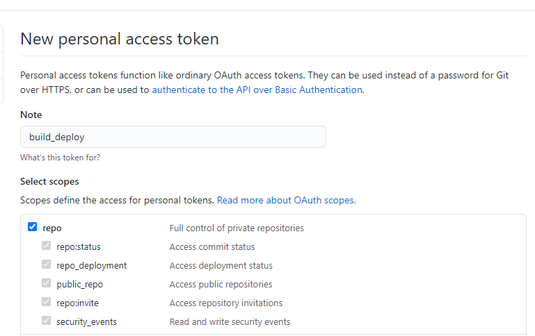
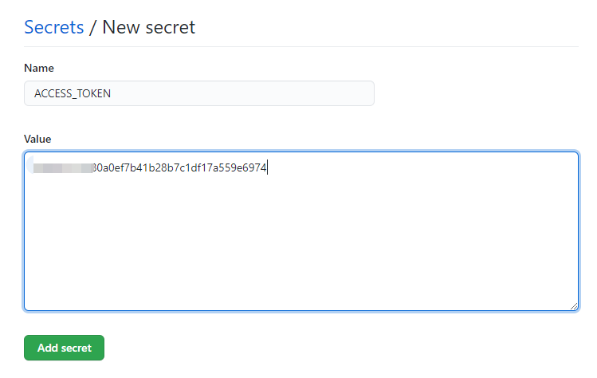

# 用 GitHub Actions 部署 Vue 项目到 GitHub Pages

实现每次 Push 代码之后，自动构建测试并部署到 GitHub Pages 的分支上

## 配置 ACCESS_TOKEN

- 打开 https://github.com/settings/tokens ，点击右上方 Generate new token， 生成一个token

    Note：  给token起一个名字，比如 build_deploy，然后把 repo 的候选框选中。最后点下面的绿色按钮，跳转页面后获得一个 key，这个 key 只会出现一次，先复制下来，一会要用。

    

- 打开项目中的 Settings，点击侧栏 Secrets，点击右上角 New secrets，输入名称 ACCESS_TOKEN，这个名字可以自定义，相当于定义了一个环境变量。然后把刚才复制的token粘贴到 value 里，保存。

    

## 创建 GitHub Workflows 配置文件

- 方法1：在项目根目录下.github/ 文件夹下创建workflows文件夹，新建 YAML 文件如下，名字可以随意如：build_deploy.yml

- 方法2：在项目中点击actions创建，参考： 
[GitHub Actions 入门教程 - 阮一峰的网络日志](https://www.ruanyifeng.com/blog/2019/09/getting-started-with-github-actions.html)


```yml
# 参考： https://github.com/marketplace/actions/deploy-to-github-pages

name: Build and Deploy Vue3 Project

# 触发条件
on:
  push:
    branches: [ main ]
  pull_request:
    branches: [ main ]

jobs:
  build-and-deploy:
    # 运行环境
    runs-on: ubuntu-latest

    steps:
     # 使用官方checkout下载代码
      - name: Checkout  
        uses: actions/checkout@v2.3.1
        with:
          persist-credentials: false

      - name: Install and Build
        run: |
          yarn
          yarn build

      - name: Deploy
        uses: JamesIves/github-pages-deploy-action@3.7.1
        with:
          ACCESS_TOKEN: ${{ secrets.ACCESS_TOKEN }}
          BRANCH: gh-pages
          FOLDER: dist
          CLEAN: true

```

## 访问地址： https://bugwang-work.github.io/blog-vue-node/

- 如果出现资源访问不到的问题，需要修改配置文件